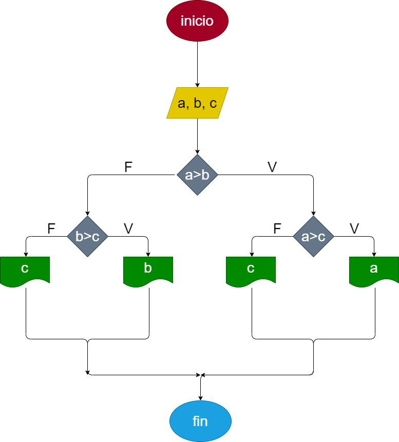

# Analisis, diseño y contruccion para hallar el mayor de tres numeros enteros

# Analisis: 3 variables, a, b, c; comparaciones entre los tres 

# Diseño: comparacion a>b, si se cumple, comparar a>c, si se cumple a es el mayor, si no c es el mayor, si no se cumple a>b, comparar b>c, si se cumple b es el mayor, si no c es el mayor

## Diagrama de flujo
